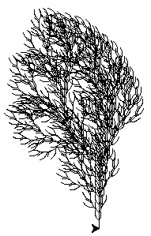

# DataStructure
A course where C and C++ was presented. In order to fully take a grasp of this programming language, a small project was given.

An L-system made in C++ and displayed in Python with turtle.

This L-system is a set of symbols that each represent a certain action to be performed. In this case, the turtle will perform this set of actions and this is used to draw some curves.

In this set, multiple alphabets are used to compose a certain pattern.

One example is the famous three pattern which has the following alphabet: ```alphabet{'F','+','-','[',']'}```.
Where
|--|--|
|F|forward|
|+|turn right 60°|
|-|turn left 60°|
|[|enter a branch|
|]|leave a branch|

which yields something like this:
```FF-[-F+F+F]+[+F-F-F]FF-[-F+F+F]+[+F-F-F]```
but then much much longer.

To create something, tun the *main* in file *cmake_build-debug*. This gives you some options to create a certian L-system.
Afterwards, add this filename - given by the program - inside the python application at the correct spot. 

So an example if we select Three, then we add ```../output/Three{timestamp}.txt``` to ```elif typen == 5:``` in the Turtle.py code.
Run the code and magic happens! If you would like to see the turtle moving arround, you can set ```turtle.speed(0)``` to something like ```turtle.speed(1)``` and disable line ```turtle_screen.tracer(0)```.

An example of such a three generation below.




